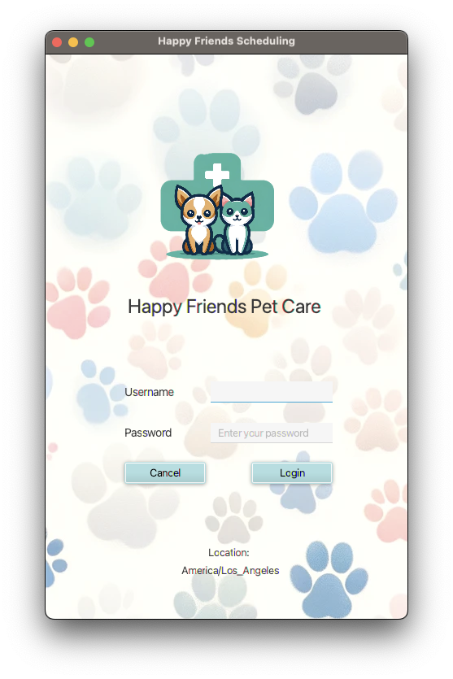

<h1>Title: WGU C195 - Appointment Scheduler</h1>
<h2>Purpose:  
Login system with the ability to access the existing SQL database with functionality to update/ add/ delete appointments and customer info. (Support English/ French language for application alert, a system restart may be required)
</h2>
<ul>
  <li>Author: Bao Tran</li>
  <li>Student ID# 001683938</li>
  <li>Application Version 1.1</li>
  <li>Date: 11/14/2023</li>
  <li>IDE: IntelliJ IDEA 2023.2.2 (Community Edition) x646</li>
  <li>JDK version: Java 17.0.1</li>
  <li>JavaFX version: JAVAFX.SDK.17.0.1</li>
</ul>

<b>INSTRUCTION:<b>  
How to run the program:  
Username: test  
Password: test

<h2>LOGIN SCREEN:</h2>

Launch the program, enter username with password (case sensitive) on the login screen, click the login button, or cancel to exit the program.
The system will pop up the alert if the username and/or password are incorrect, then let the user try again.
Once the user has been validated and logged in - an alert will be displayed letting the user know if there are any appointments within 15 minutes or not.

<h2>MAIN MENU:</h2>

After the appointment reminder notification, the user will be directed to the main menu where 4 buttons will appear on the screen.

<h2>CUSTOMER:</h2>

The customer button will display a table with all the available customer information, it also comes with 3 buttons below (Update,  Add, Delete).
The update button will update an existing contact, the add button will create a new customer, and the delete will remove an existing customer from the system.
The back-to-menu button will return to the main menu screen.

<h2>APPOINTMENT:</h2>

The appointment button will display all existing appointments by default. The user can filter from all appointments, the next rolling week, and the
next rolling month appointments by selecting each radio button on top of the table, it also comes with 3 buttons below the table (Update,  Add, Delete). The update button will update an existing appointment, the add button create a new appointment and the delete button will delete the selected appointment from the system.
The back-to-menu button will return to the main menu screen.

<h2>REPORTS:</h2>

The report button will display the report list where there will be three tabs on the top of 2 tables. Appointment Totals, Contact Schedules, and Customer Totals by Country, each tab will have a different report.
The appointment totals tab displays the different appointment types and their associated totals. On the right side of the appointment totals tab, the appointment totals are broken down by month.
The contact schedules tab has a combo box that allows you to select a contact and will display appointments associated with the content in the table view.
The Customer Totals By Country tab shows the number of Customers per country.
The back-to-menu button will return to the main menu screen.

MySQL Connector Driver Version: mysql-connector-java-8.0.25

